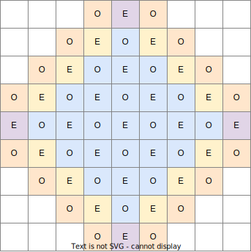

### Part 1. Reducing the search complexity
There are many ways to travel from two points in a grid given a path length. However, notice that the parity is maintained. That is, if you can travel from A to B in 16 steps, then you can also do it in 18, 20, 22, 24, etc. The opposite is true as well, you will not be able to travel in any odd number of steps.

More generally, if there exists a path between A and B of length $p$, the paths with length $p+2n, \forall n \in \text{Z} \geq 0$ will also exist; and no path of length $p + 2n +1, \forall n \in \text{Z}$ will exist.

Hence, we don't need to find all cells that can be reached in 64 steps, but rather all cells that can be reached in an even number of steps less or equal to 64.

### Part 2. Input analysis required
The distance to flood is 26501365 cells. On an empty grid, this would mean visiting upwards of a trillion cells. This is not feasible. However, look at the input. Notice how:
1. The rocks are very sparse, so trips are mostly straightforward
2. The start is at the very center
3. The starting row and column are empty
4. The leftmost and rightmost columns are empty
5. The top and bottom rows are empty
6. There are empty diagonals connecting the side midpoints

This essentially means that we can work in blocks rather than cells. Each block measures 131 by 131 cells.

Hence, the flood tip exiting the first block has 26501300 more steps to go. This means exactly 202300 more blocks. We can therefore expect the area around the block at row 0, column 202300 to look like the following image. Note that every square is a block, not a cell.

We see five types of blocks arise, depending on what area is flooded.
- Blue: fully painted blocks
- Yellow: flood enters from the top left with 66 steps to go.
- Orange: flood enters from the top left with 195 steps to go.
- Purple: flood enters from the left with 131 steps to go.
- White: flood does not enter

If instead of 202300 we had an expanse of 4 blocks, the result would look like this:

There is one last layer of complexity: which parity do we choose for each block? The central block is simple because it's the same as part 1, so we know the parity is even. However notice that when traveling to the next blue block, all the distances increase by 65, so the parities flip. This happens every time you switch blue blocks.

See the same geometry as before, with blocks labeled whether they are even or odd:

If the grid was completely empty, we could simply add up the proportions of the blue, yellow, orange and purple sides and we'd be done. However this is not the case, but there are only 13 unique blocks:
- 1 blue block (with two parities)
- 4 orange blocks (one for each side)
- 4 yellow blocks (one for each side)
- 4 purple block (one for each corner)

So, we can precompute the even/odd sizes of these 13 blocks, and then multiply their counts:
This means:
- $n^2$ odd blue squares.
- $(n-1)^2$ even blue squares.
- $n = 4$ odd orange squares per side.
- $n = 4$ even yellow squares per side.
- $1$ even purple square per corner.

Part 2 of my implementation automates this process.